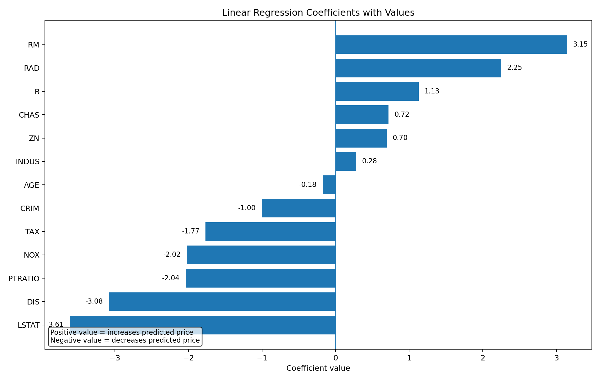
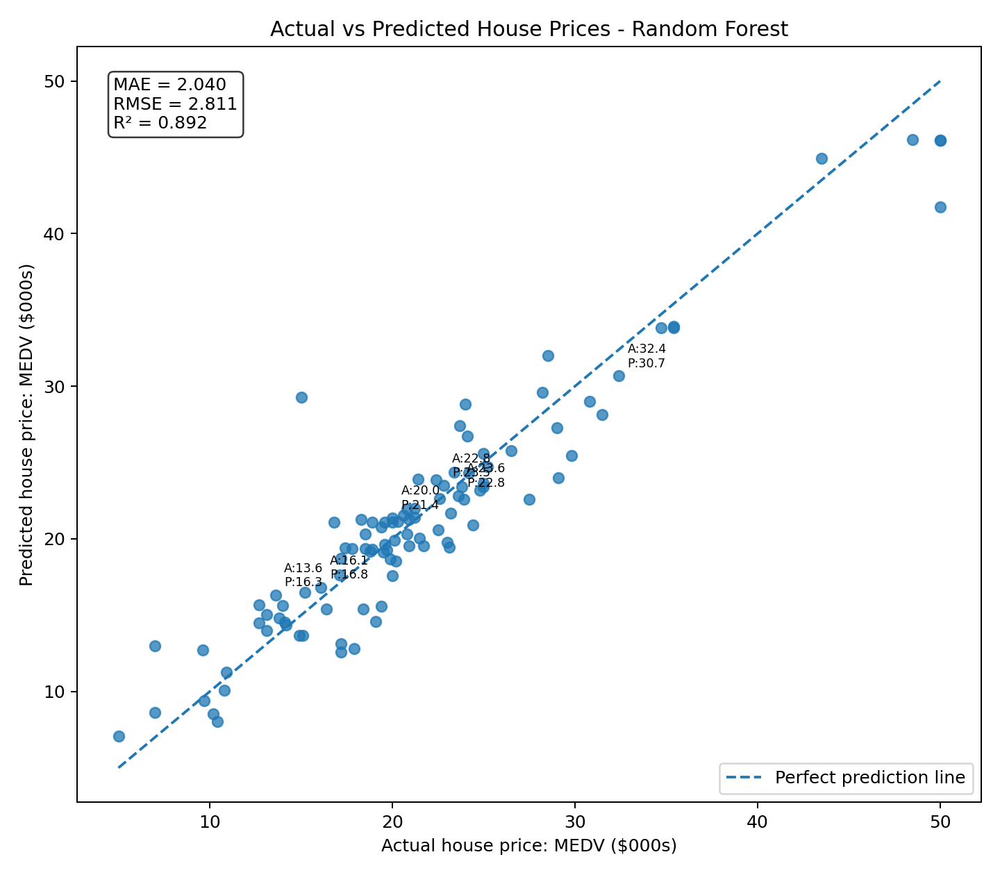
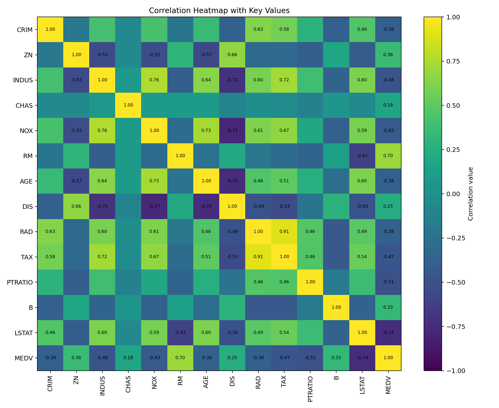
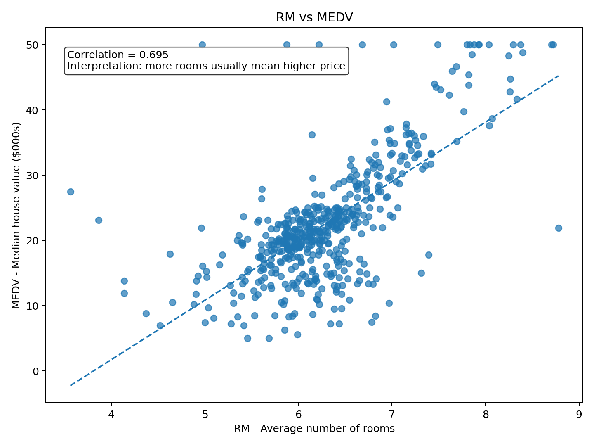
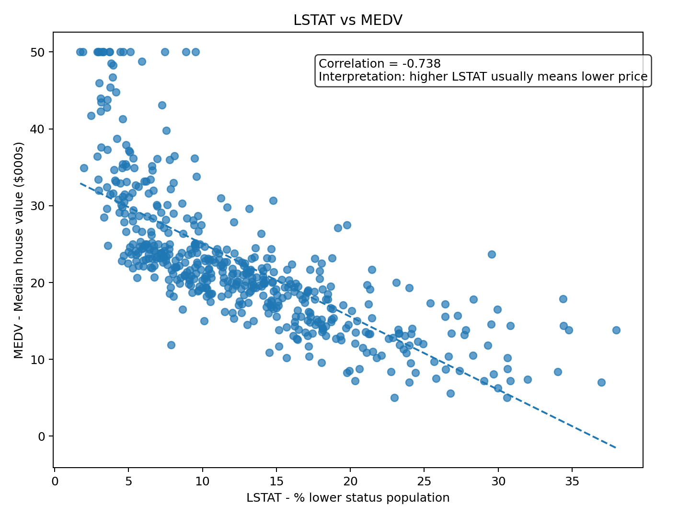
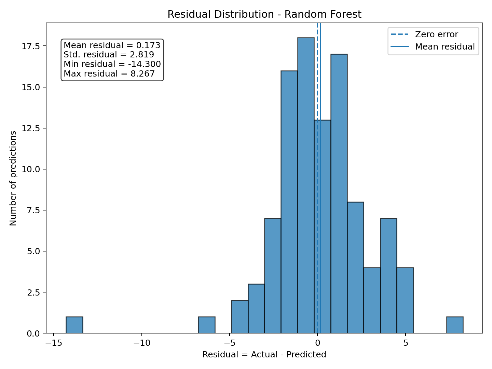
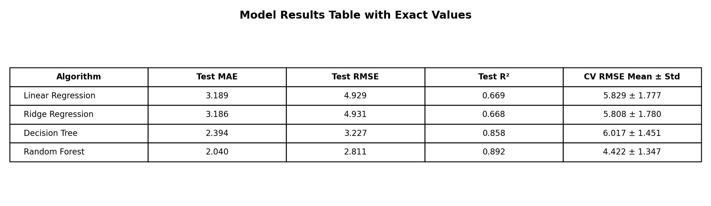

# House Price Prediction

This project is a **supervised machine learning regression problem** that predicts house price as a **numeric value** using the Boston Housing dataset.

## Kaggle Notebook

Notebook link: [House Price Prediction on Kaggle](https://www.kaggle.com/code/mnoumanrasheed/house-price-prediction)

## Dataset Source

- **UCI / StatLib source:** [Boston Housing Dataset](https://archive.ics.uci.edu/ml/machine-learning-databases/housing/)
- **Kaggle dataset source:** [Boston House Prices on Kaggle](https://www.kaggle.com/datasets/vikrishnan/boston-house-prices)

The dataset contains **506 records**, **13 input features**, and one target variable, **MEDV**. `MEDV` represents the median value of owner-occupied homes in Boston suburbs, measured in thousands of dollars.

## Honest Note About the `B` Feature

The dataset contains a feature named **B**, originally defined as `1000(Bk - 0.63)^2`, where `Bk` relates to racial composition by town. This is an ethically sensitive feature. It is kept here only because it is part of the original educational Boston Housing dataset. For a real-world housing-price model, this feature should be removed or reviewed very carefully before any use.

## Problem Type

| Item | Description |
|---|---|
| Machine Learning Type | Supervised learning |
| Problem Category | Regression |
| Target Variable | MEDV |
| Prediction Output | Numeric house price value |
| Main Goal | Predict house prices with lower error |

## Project Workflow

- Loaded the Boston Housing dataset and assigned proper column names.
- Explored the data using summary statistics and visual analysis.
- Checked correlations between input features and the target variable `MEDV`.
- Split the data into training and testing sets.
- Scaled the data for Linear Regression and Ridge Regression.
- Trained Linear Regression, Ridge Regression, Decision Tree, and Random Forest models.
- Evaluated performance using MAE, RMSE, R², and cross-validation RMSE.
- Created visual outputs with values displayed directly on the charts.

## Key EDA Finding

The strongest predictors of house price are **RM** and **LSTAT**.

| Feature | Correlation with MEDV | Meaning |
|---|---:|---|
| RM | 0.695 | Positive relationship. Houses with more average rooms usually have higher prices. |
| LSTAT | -0.738 | Negative relationship. Areas with a higher lower-status population percentage usually have lower prices. |

**Main finding:** `RM` increases house price, while `LSTAT` decreases house price. These two variables are the clearest predictors in the EDA.

## Model Results

| Algorithm | Test MAE | Test RMSE | Test R² | CV RMSE Mean ± Std |
|---|---:|---:|---:|---:|
| Linear Regression | 3.189 | 4.929 | 0.669 | 5.829 ± 1.777 |
| Ridge Regression | 3.186 | 4.931 | 0.668 | 5.808 ± 1.780 |
| Decision Tree | 2.394 | 3.227 | 0.858 | 6.017 ± 1.451 |
| Random Forest | 2.040 | 2.811 | 0.892 | 4.422 ± 1.347 |

## Visual Outputs

All visual outputs are placed inside the separate `screenshots` folder. Values are now visible directly on the images.

### 1. Coefficient Bar Chart with Values

This chart shows the Linear Regression coefficients with exact numeric coefficient values displayed on the bars.



### 2. Actual vs Predicted Scatter Plot with Values

This chart shows the Random Forest predictions against actual house prices. It also displays MAE, RMSE, R², and sample actual/predicted values.



### 3. Correlation Heatmap with Values

This heatmap shows correlation values, including the key relationships between `RM`, `LSTAT`, and `MEDV`.



### 4. RM vs MEDV with Correlation Value

This chart shows the positive relationship between average number of rooms and house price.



### 5. LSTAT vs MEDV with Correlation Value

This chart shows the negative relationship between `LSTAT` and house price.



### 6. Residual Distribution with Values

This chart shows prediction errors and includes mean, standard deviation, minimum, and maximum residual values.



### 7. Model Results Table Image

This image shows the model comparison table with exact values, useful for quick visual review on GitHub.



## What RMSE Means in Plain Language

**RMSE** means Root Mean Squared Error. In this project, it tells us the typical size of the model's house-price prediction error. A lower RMSE means the predicted house prices are closer to the real house prices.

## What R² Means in Plain Language

**R²** explains how much of the variation in house prices is captured by the model. For example, an R² value of **0.892** means the model explains about **89.2%** of the variation in test-set house prices. A higher R² is better, but it does not mean the model is perfect.

## Final Model Selection

The selected model is **Random Forest Regressor**.

### Why Random Forest Was Chosen

Random Forest was chosen because it achieved the best overall performance in this workflow:

- Lowest Test MAE: **2.040**
- Lowest Test RMSE: **2.811**
- Highest Test R²: **0.892**
- Best CV RMSE mean: **4.422 ± 1.347**

### Limitations

- The Boston Housing dataset is old and small.
- The dataset may not represent current housing markets.
- The `B` feature has ethical concerns and should not be used in real-world deployment without review.
- Random Forest is less interpretable than Linear Regression.
- The model may not generalize well to other cities or modern housing data.
- Real house prices depend on many factors not included in this dataset.

## Technologies Used

- Python
- Pandas
- NumPy
- Matplotlib
- Scikit-learn
- Jupyter Notebook

## How to Run Locally

Install the required libraries:

```bash
pip install -r requirements.txt
```

Then open and run the notebook in Jupyter Notebook, JupyterLab, VS Code, or Kaggle.

## Repository Structure

```text
house-price-prediction/
├── README.md
├── requirements.txt
└── screenshots/
    ├── 01_coefficient_bar_chart_with_values.png
    ├── 02_actual_vs_predicted_scatter_with_values.png
    ├── 03_correlation_heatmap_with_values.png
    ├── 04_rm_vs_medv_correlation_value.png
    ├── 05_lstat_vs_medv_correlation_value.png
    ├── 06_residual_distribution_with_values.png
    └── 07_model_results_table_with_values.png
```

## Output Image Note

The screenshots are generated from the Boston Housing dataset using the same notebook-style workflow. The values are visible on the images and match the tables shown in this README.
