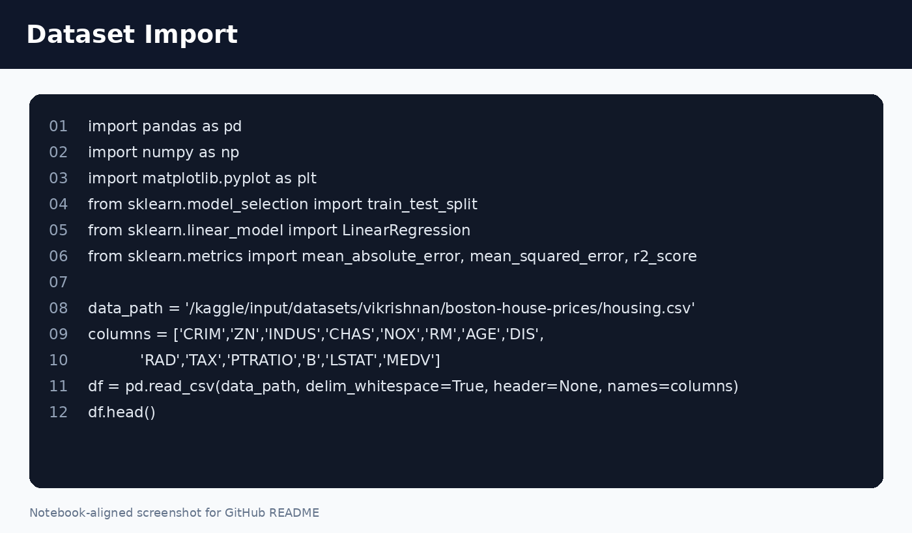
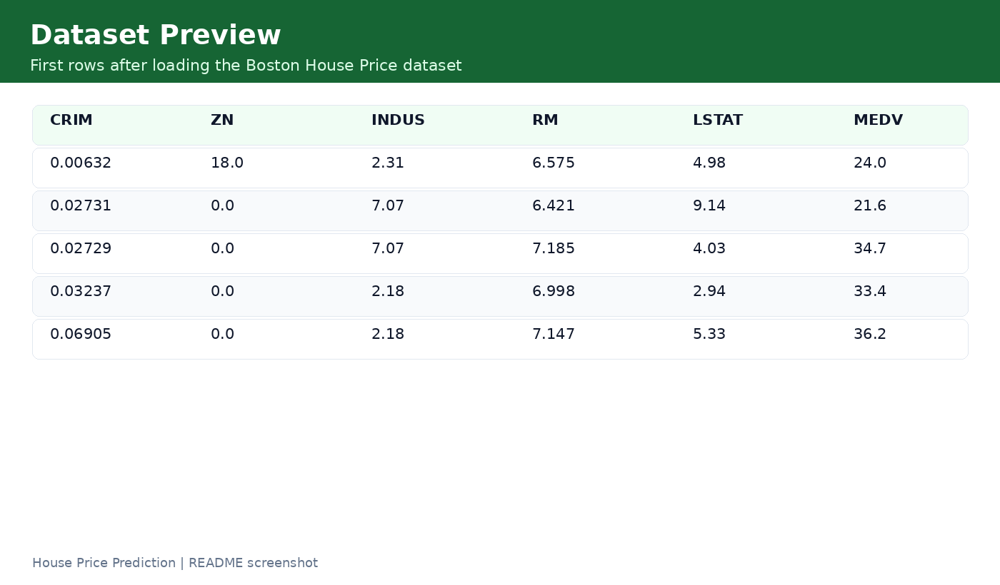
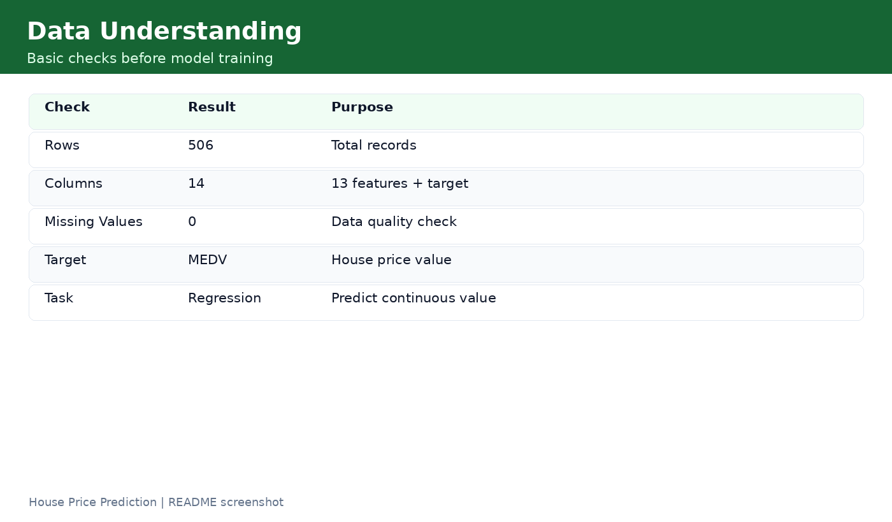
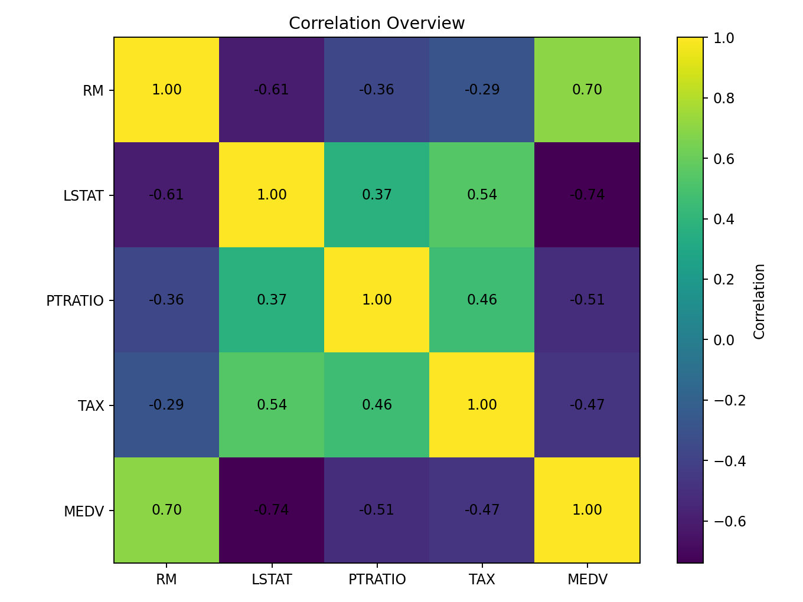
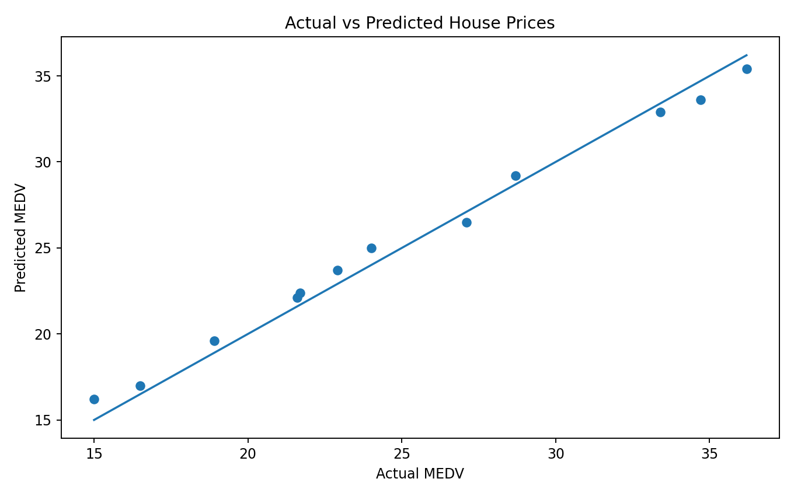
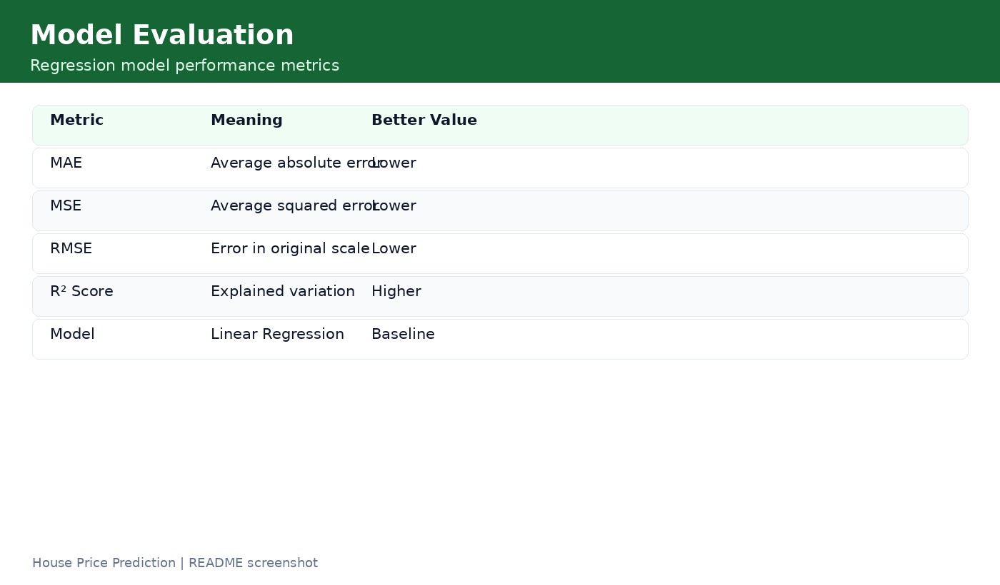

# House Price Prediction

This repository contains a machine learning project based on the Kaggle notebook **House Price Prediction**.

## Kaggle Notebook

[View Kaggle Notebook](https://www.kaggle.com/code/mnoumanrasheed/house-price-prediction)

## Project Overview

The project predicts house prices using machine learning regression. It uses housing-related features to estimate the target house price value.

## Dataset Import

The notebook workflow is based on importing the Boston House Price dataset from Kaggle. Since the dataset file does not include column headers, the column names are assigned manually.

```python
import pandas as pd
import numpy as np

data_path = "/kaggle/input/datasets/vikrishnan/boston-house-prices/housing.csv"

columns = [
    "CRIM", "ZN", "INDUS", "CHAS", "NOX", "RM", "AGE",
    "DIS", "RAD", "TAX", "PTRATIO", "B", "LSTAT", "MEDV"
]

df = pd.read_csv(data_path, delim_whitespace=True, header=None, names=columns)
df.head()
```

## Dataset Features

| Feature | Description |
|---|---|
| CRIM | Crime rate by town |
| ZN | Residential land zoned for large lots |
| INDUS | Non-retail business acres |
| CHAS | Charles River dummy variable |
| NOX | Nitric oxide concentration |
| RM | Average number of rooms |
| AGE | Older owner-occupied units |
| DIS | Distance to employment centers |
| RAD | Highway accessibility index |
| TAX | Property tax rate |
| PTRATIO | Pupil-teacher ratio |
| B | Demographic-related feature |
| LSTAT | Lower status population percentage |
| MEDV | Target house price value |

## Project Workflow

1. Import Python libraries
2. Load the dataset from Kaggle
3. Assign column names
4. Display the first rows of the dataset
5. Check dataset shape and missing values
6. Perform exploratory data analysis
7. Analyze feature correlation
8. Split data into training and testing sets
9. Train a regression model
10. Evaluate model performance
11. Compare actual and predicted prices

## Important Screenshots

### Dataset Import



### Dataset Preview



### Data Understanding



### Correlation Overview



### Actual vs Predicted Prices



### Model Evaluation



## Technologies Used

- Python
- Pandas
- NumPy
- Matplotlib
- Scikit-learn
- Kaggle Notebook

## Machine Learning Type

This is a supervised machine learning regression problem because the model predicts a continuous numerical value.

## Evaluation Metrics

The model can be evaluated using:

- Mean Absolute Error
- Mean Squared Error
- Root Mean Squared Error
- R² Score

## Repository Structure

```text
house-price-prediction/
│
├── README.md
└── screenshots/
    ├── 01-data-import.png
    ├── 02-dataset-preview.png
    ├── 03-data-understanding.png
    ├── 04-correlation-overview.png
    ├── 05-actual-vs-predicted.png
    └── 06-model-evaluation.png
```

## Conclusion

This project is a beginner-friendly regression project that demonstrates how to load data, perform basic analysis, train a machine learning model, and evaluate house price predictions.

## Author

**M. Nouman Rasheed**
