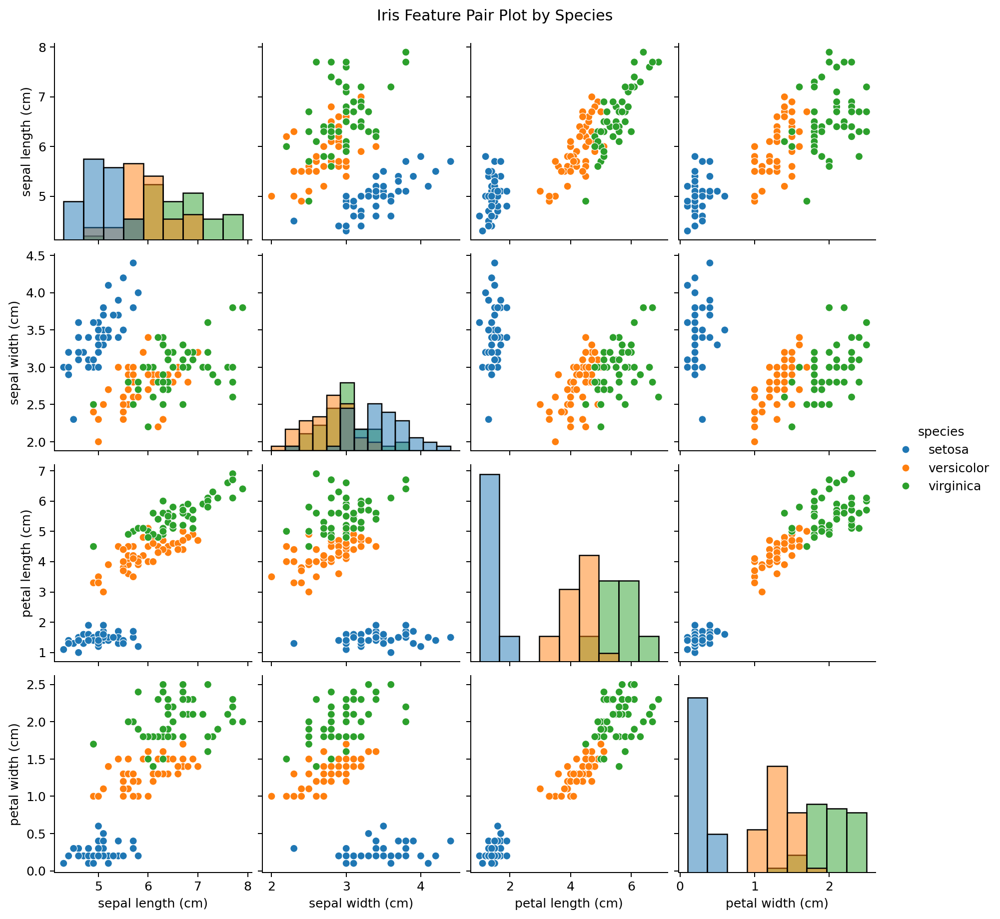
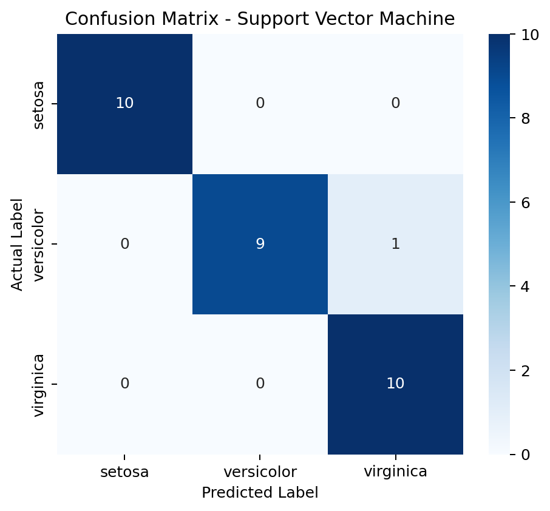
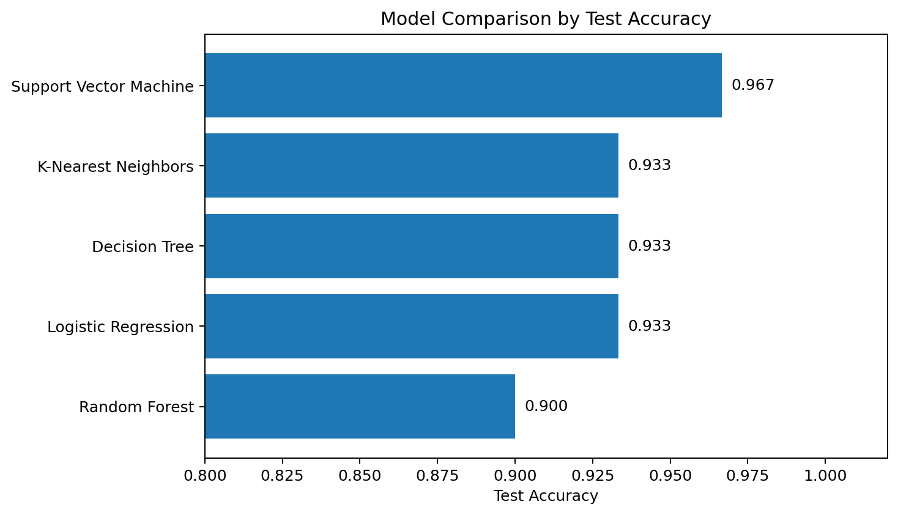
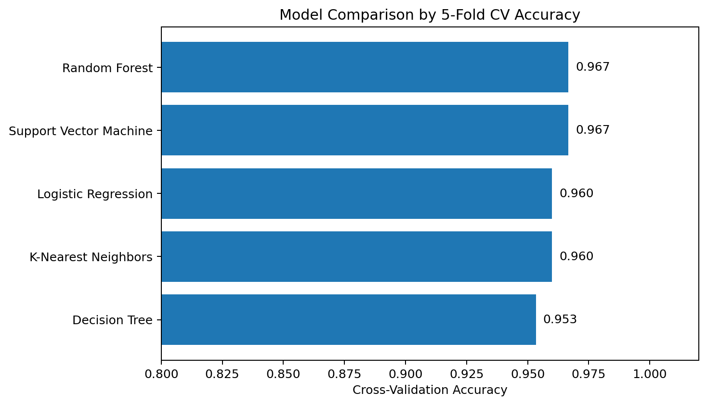
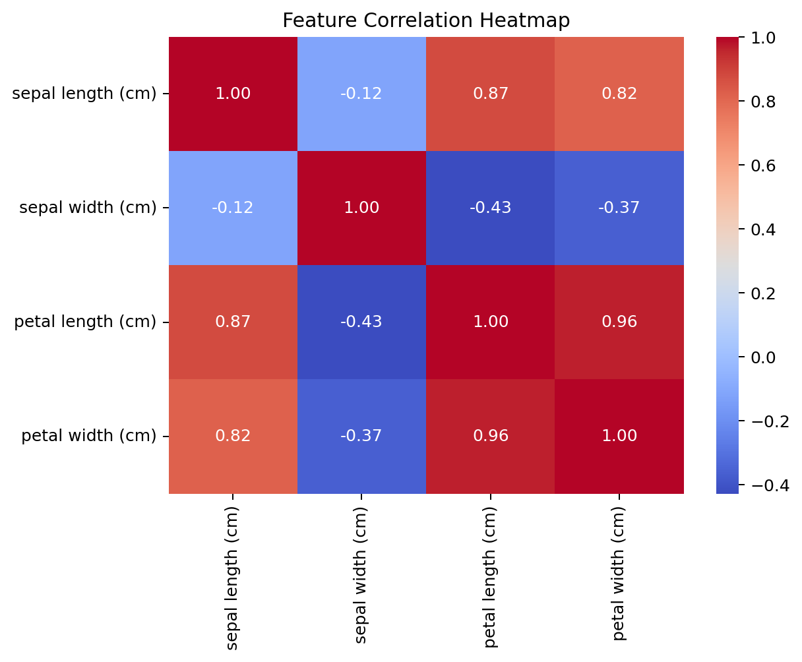
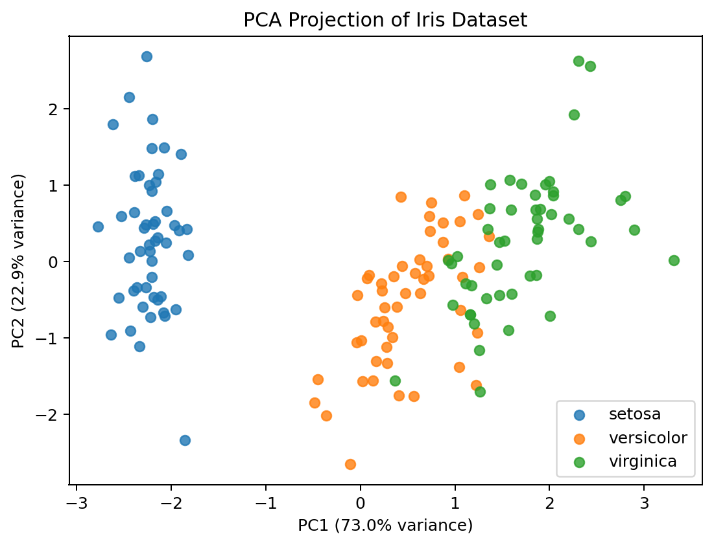
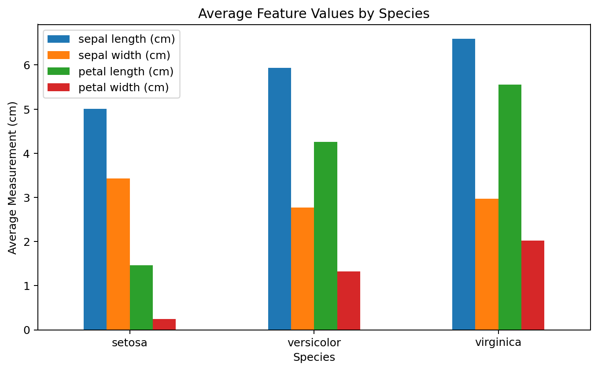

# Iris Flower Species Classifier

This project classifies Iris flowers into Setosa, Versicolor, and Virginica species using supervised machine learning algorithms.

## Dataset Source

- UCI Machine Learning Repository: [https://archive.ics.uci.edu/dataset/53/iris](https://archive.ics.uci.edu/dataset/53/iris)
- Kaggle Dataset: [https://www.kaggle.com/datasets/uciml/iris](https://www.kaggle.com/datasets/uciml/iris)
- Kaggle Notebook: [https://www.kaggle.com/code/mnoumanrasheed/iris-flower-species-classifier](https://www.kaggle.com/code/mnoumanrasheed/iris-flower-species-classifier)

The Iris dataset contains flower measurements including sepal length, sepal width, petal length, and petal width. The target variable is the flower species.

## Algorithms Used

- Logistic Regression
- K-Nearest Neighbors
- Support Vector Machine
- Decision Tree
- Random Forest

## Results

| Algorithm | Test Accuracy | CV Accuracy |
|---|---:|---:|
| Logistic Regression | 0.9333 | 0.9600 |
| K-Nearest Neighbors | 0.9333 | 0.9600 |
| Support Vector Machine | 0.9667 | 0.9667 |
| Decision Tree | 0.9333 | 0.9533 |
| Random Forest | 0.9000 | 0.9667 |

## Visual Results

### 1. Pair Plot



### 2. Confusion Matrix



### 3. Test Accuracy Comparison



### 4. Cross-Validation Accuracy Comparison



### 5. Feature Correlation Heatmap



### 6. PCA Species Scatter Plot



### 7. Average Feature Values by Species



## How to Run Locally

Install the required libraries:

```bash
pip install -r requirements.txt
```

Then run the notebook:

```bash
jupyter notebook iris-flower-species-classifier.ipynb
```

## Conclusion

The best model in this run was **Support Vector Machine**, selected because it achieved the strongest combination of test accuracy and cross-validation accuracy. The visual analysis also shows that Iris species are highly separable, especially through petal length and petal width. This makes the Iris dataset a suitable beginner classification project for comparing machine learning models and understanding how feature patterns help predict categories.
