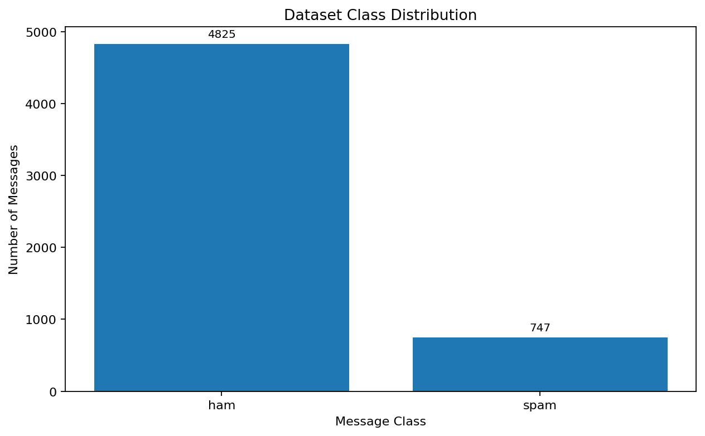
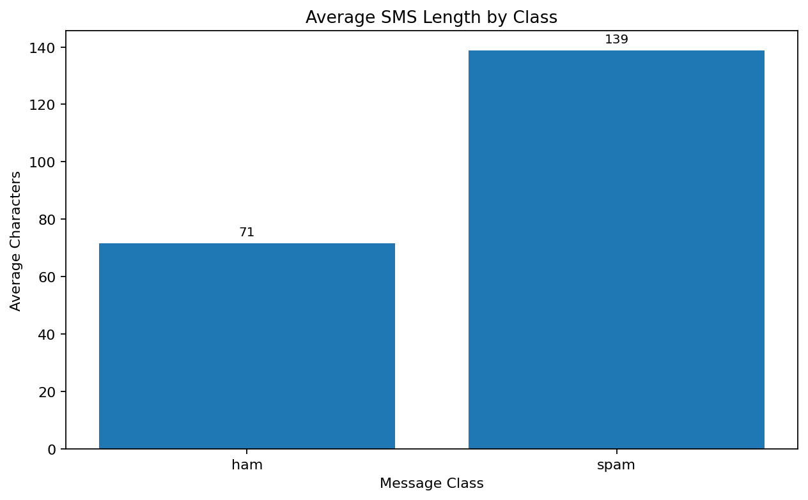
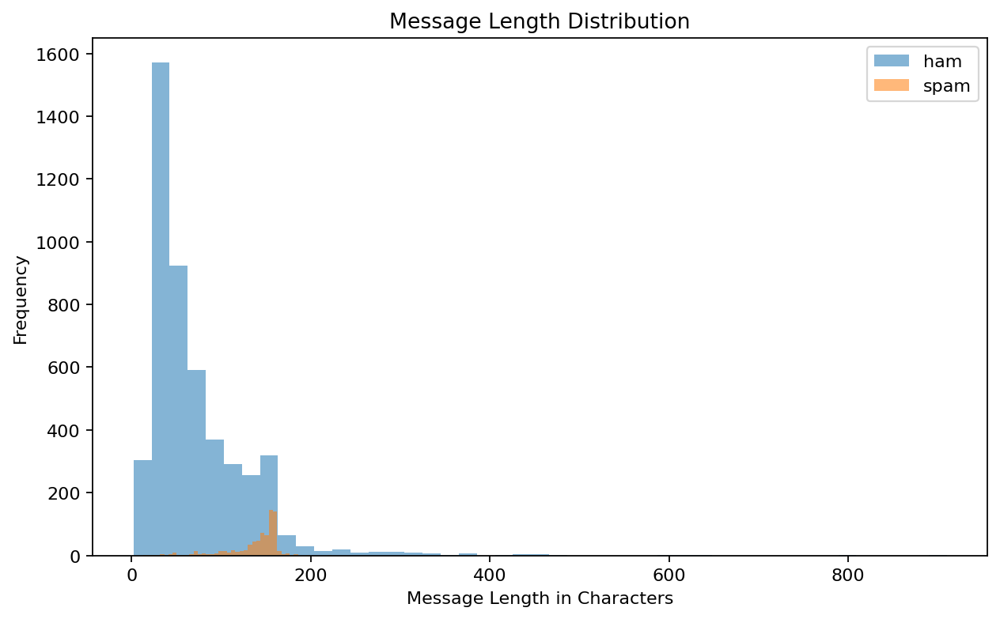
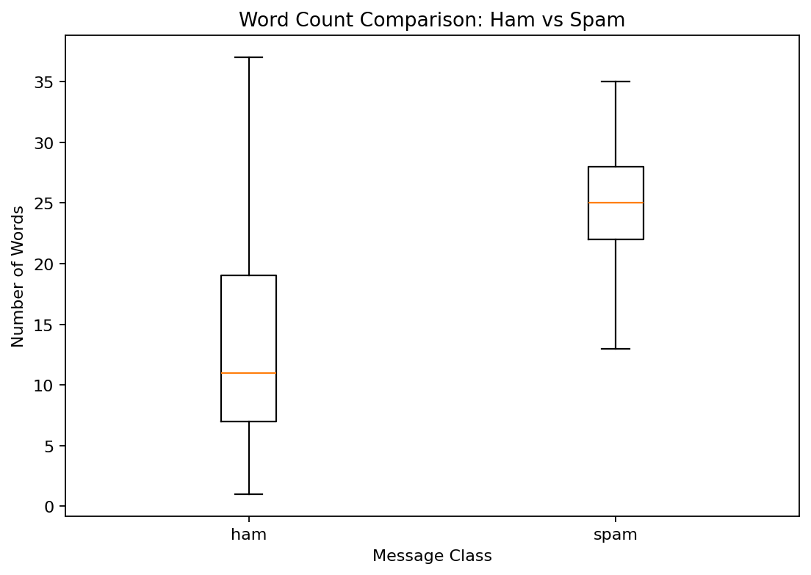
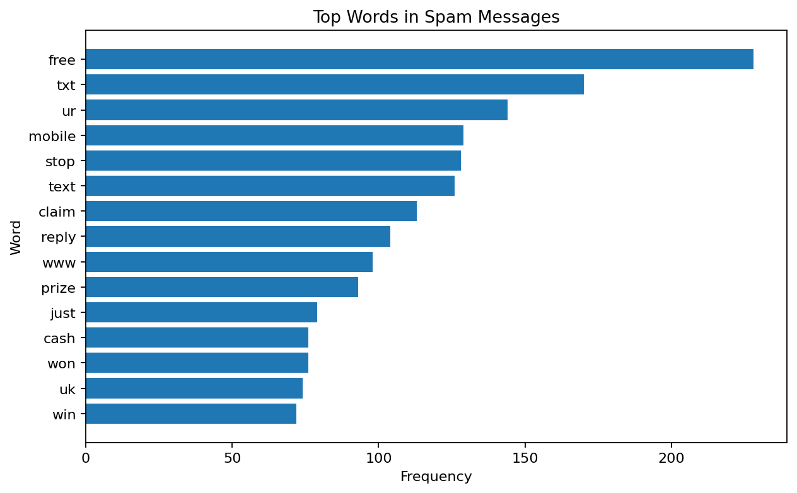
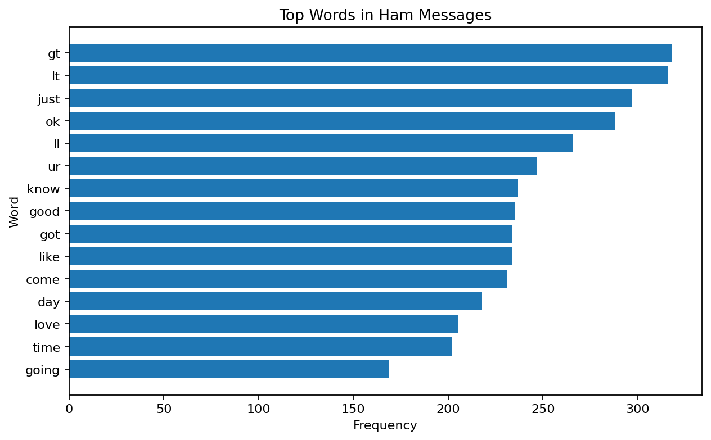
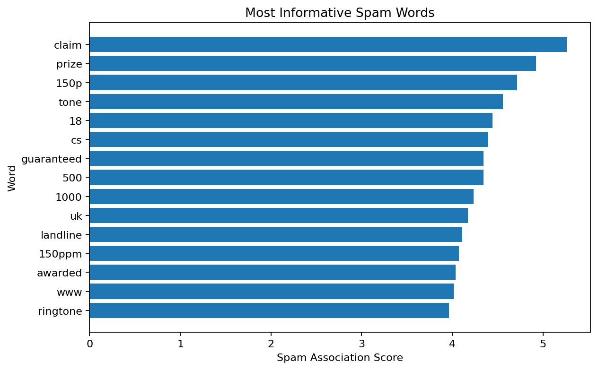
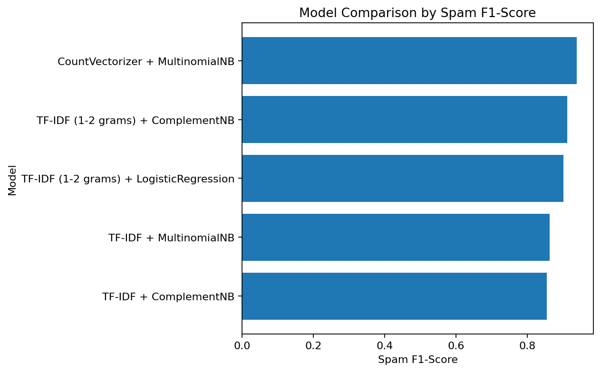
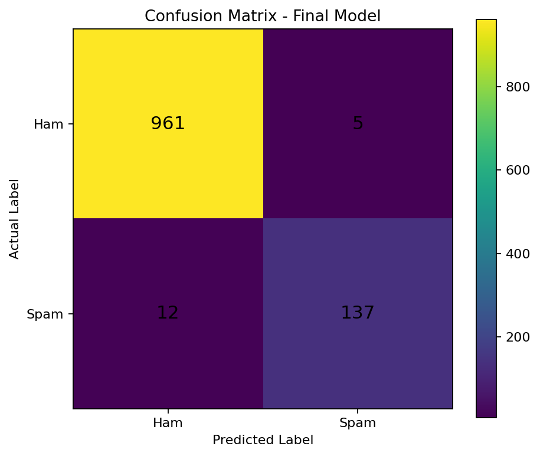

# SMS Spam Classifier

This is a text classification project that classifies SMS messages as **spam** or **ham** using Natural Language Processing and supervised machine learning.

## Project Type

This is **not a tabular machine learning project**. The input is raw SMS text, so the main task is text cleaning, vectorisation, and classification.

## Dataset Source

- **UCI Machine Learning Repository:** [SMS Spam Collection](https://archive.ics.uci.edu/dataset/228/sms+spam+collection)
- **Kaggle Dataset:** [SMS Spam Collection Dataset](https://www.kaggle.com/datasets/uciml/sms-spam-collection-dataset)
- **Kaggle Notebook:** [SMS Spam Classifier](https://www.kaggle.com/code/mnoumanrasheed/sms-spam-classifier)

The dataset contains SMS messages labelled as either **ham** or **spam**. The task is to learn patterns in the message text and predict whether a new SMS is spam.

## Why Accuracy Is Not the Primary Metric

Accuracy can be misleading in this project because most SMS messages are ham. A model can look accurate by mostly predicting “ham”, but that does not mean it is good at catching spam. For a spam classifier, the important question is how well the model identifies actual spam without wrongly blocking normal messages. Therefore, **spam precision**, **spam recall**, and **spam F1-score** are more useful than accuracy.

In simple words:

- **Spam precision** tells us: when the model says a message is spam, how often is it correct?
- **Spam recall** tells us: out of all real spam messages, how many did the model catch?
- **Spam F1-score** balances precision and recall into one score.

## Algorithms Used

- Multinomial Naive Bayes
- Complement Naive Bayes
- Logistic Regression

## Text Preprocessing Pipeline

- Converted all SMS text to lowercase so that words like `FREE` and `free` are treated the same.
- Removed punctuation, symbols, and numbers to keep the focus on useful words.
- Removed common stopwords such as `the`, `is`, and `and` because they usually do not help much in spam detection.
- Converted cleaned text into numerical features using **CountVectorizer** and **TF-IDF Vectorizer**.
- Trained classification models on the vectorised text.
- Evaluated the models using spam precision, spam recall, spam F1-score, cross-validation F1, and a confusion matrix.

## Exploratory Data Analysis

### Dataset Class Distribution



### Key EDA Finding

Spam messages are nearly twice as long as ham messages.

| Message Type | Average Length |
|---|---:|
| Ham | 71.48 characters |
| Spam | 138.67 characters |



### Message Length Distribution



### Word Count Comparison



## Word-Level Analysis

### Top Words in Spam Messages



### Top Words in Ham Messages



### Most Informative Spam Words

The chart below shows words that were most strongly associated with spam messages in the final Naive Bayes model.



## Model Results

| Vectoriser         | Algorithm          |   Spam Precision |   Spam Recall |   Spam F1 |   CV F1 |
|:-------------------|:-------------------|-----------------:|--------------:|----------:|--------:|
| CountVectorizer    | MultinomialNB      |           0.958  |        0.9195 |    0.9384 |  0.9324 |
| TF-IDF             | MultinomialNB      |           1      |        0.7584 |    0.8626 |  0.8712 |
| TF-IDF             | ComplementNB       |           0.779  |        0.9463 |    0.8545 |  0.8473 |
| TF-IDF (1-2 grams) | LogisticRegression |           0.8889 |        0.9128 |    0.9007 |  0.9199 |
| TF-IDF (1-2 grams) | ComplementNB       |           0.9241 |        0.8993 |    0.9116 |  0.9001 |

### Model Comparison Visual



## Confusion Matrix

Final model: **CountVectorizer + Multinomial Naive Bayes**

| Actual / Predicted | Ham | Spam |
|---|---:|---:|
| Ham | 961 | 5 |
| Spam | 12 | 137 |

This means the model produced **5 false positives** and **12 false negatives** on the test set.



## Final Model Selection

The final selected model is **CountVectorizer + Multinomial Naive Bayes**. It was chosen because it achieved the strongest overall spam F1-score and cross-validation F1-score while keeping false positives low.

Its trade-off is practical: it catches most spam messages with **0.9195 recall**, while maintaining strong **0.9580 precision**. This means it is careful about labelling normal messages as spam, but it may still miss a small number of spam messages.

## How to Run Locally

Install the required libraries:

```bash
pip install -r requirements.txt
```

Then run the notebook locally:

```bash
jupyter notebook sms-spam-classifier.ipynb
```

Make sure the SMS Spam Collection CSV file is available in the project directory or update the dataset path in the notebook.

## Project Files

```text
README.md
requirements.txt
screenshots/
  class_distribution.png
  message_length_eda.png
  message_length_distribution.png
  word_count_boxplot.png
  top_spam_words.png
  top_ham_words.png
  most_informative_spam_words.png
  model_f1_comparison.png
  confusion_matrix.png
```

## Conclusion

This project demonstrates a complete NLP text classification workflow for SMS spam detection. The best-performing model was **CountVectorizer + Multinomial Naive Bayes** because it provided the best balance between catching spam and avoiding incorrect spam labels for legitimate messages. The model is strong for a beginner-friendly NLP project, but its limitation is that it depends on historical SMS wording and may need retraining if spam language changes over time.
