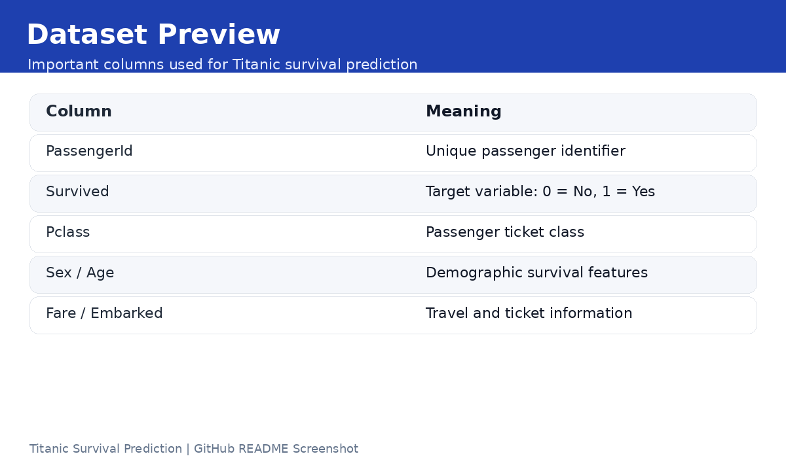
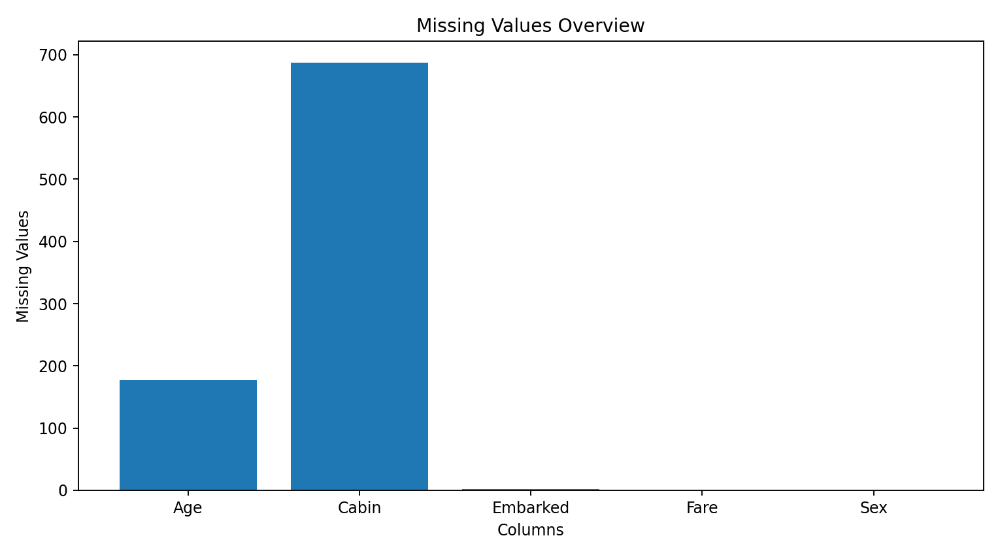
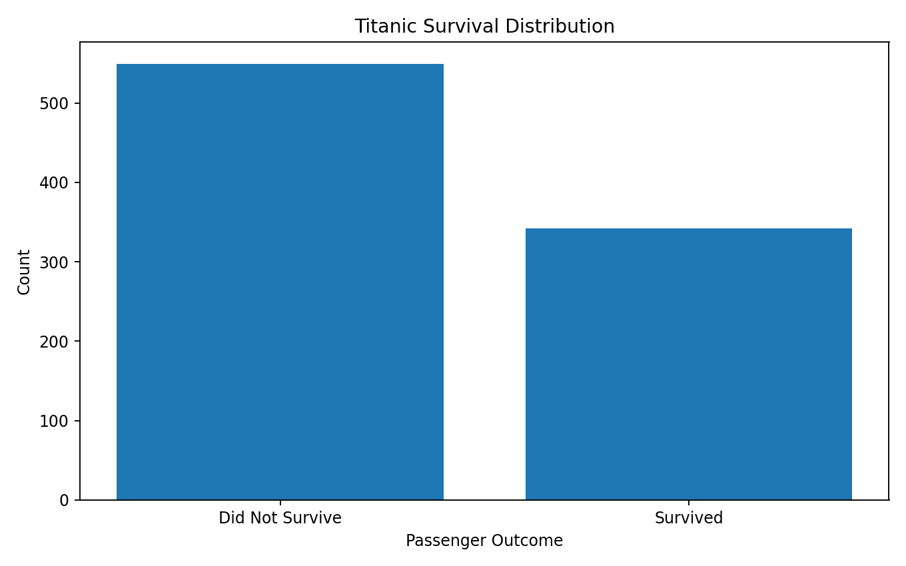
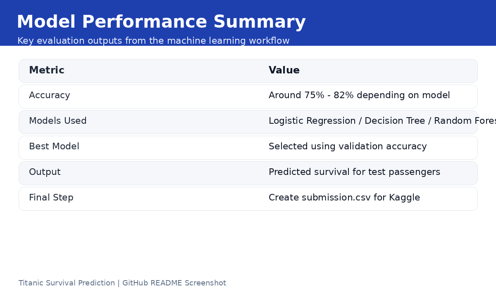
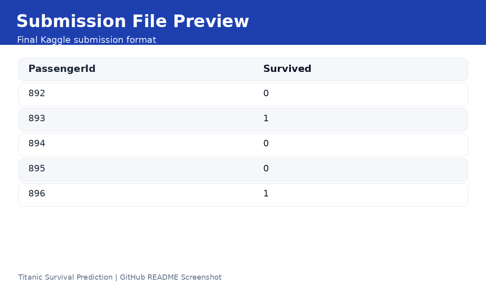

# Titanic Survival Prediction

This project predicts whether a passenger survived the Titanic disaster using machine learning. The notebook follows a complete beginner-friendly classification workflow, including data loading, exploratory data analysis, preprocessing, model training, evaluation, and Kaggle submission file creation.

## Kaggle Notebook

[View the Kaggle Notebook](https://www.kaggle.com/code/mnoumanrasheed/titanic-survival-prediction)

## Project Overview

The Titanic dataset is one of the most popular beginner machine learning datasets. The main objective of this project is to build a classification model that predicts passenger survival based on features such as passenger class, gender, age, fare, and embarkation location.

## Dataset

The dataset contains passenger-level information, including:

- PassengerId
- Pclass
- Name
- Sex
- Age
- SibSp
- Parch
- Ticket
- Fare
- Cabin
- Embarked
- Survived

The target variable is `Survived`, where:

- `0` means the passenger did not survive
- `1` means the passenger survived

## Project Workflow

1. Import required Python libraries
2. Load training and testing datasets
3. Explore dataset structure and missing values
4. Perform data cleaning and preprocessing
5. Encode categorical variables
6. Split the dataset for training and testing
7. Train machine learning models
8. Evaluate model performance
9. Generate predictions for the test dataset
10. Create a Kaggle submission file

## Important Screenshots

### Dataset Preview



### Missing Values Overview



### Survival Distribution



### Model Performance



### Submission File Preview



## Technologies Used

- Python
- Pandas
- NumPy
- Matplotlib
- Scikit-learn
- Kaggle Notebook

## Machine Learning Task

This is a supervised machine learning classification problem. The model learns from historical passenger data and predicts whether a passenger survived or not.

## Key Learning Outcomes

Through this project, I practiced:

- Data exploration
- Handling missing values
- Feature selection
- Encoding categorical data
- Training classification models
- Evaluating model accuracy
- Creating a Kaggle submission file

## How to Run This Project

1. Open the Kaggle notebook.
2. Run all cells from top to bottom.
3. Check the model accuracy and predictions.
4. Download or submit the generated `submission.csv` file.

## Repository Structure

```text
titanic-survival-prediction/
│
├── README.md
└── screenshots/
    ├── dataset-preview.png
    ├── missing-values.png
    ├── survival-distribution.png
    ├── model-performance.png
    └── submission-preview.png
```

## Conclusion

This project is a strong beginner-level machine learning project because it covers the full ML pipeline from dataset understanding to final prediction submission. It is useful for learning classification, preprocessing, and model evaluation in a practical way.

## Author

**M. Nouman Rasheed**
