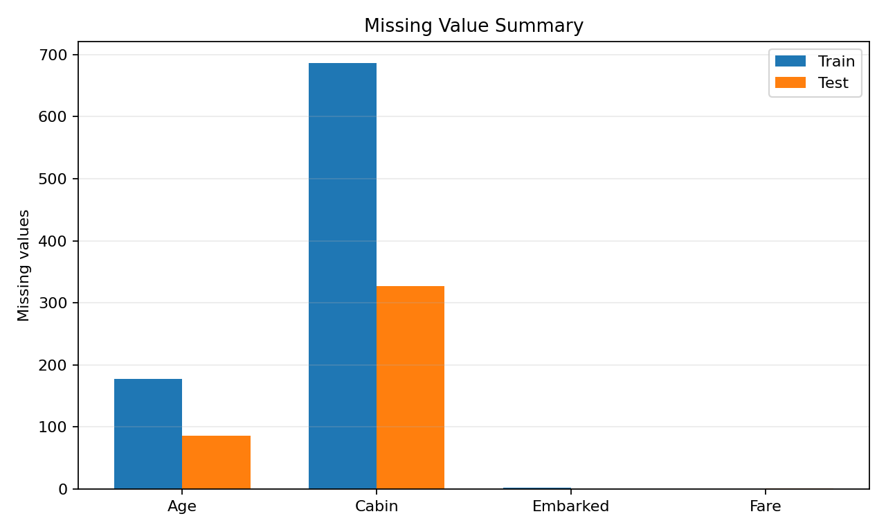
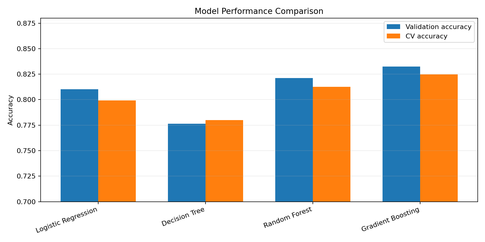
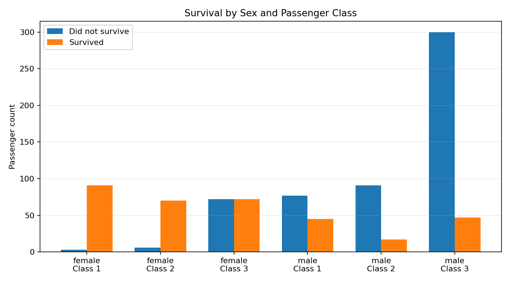
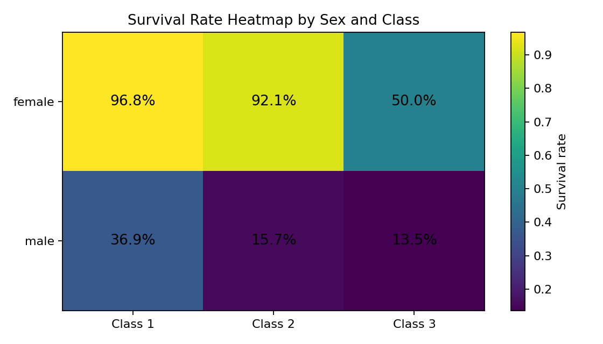
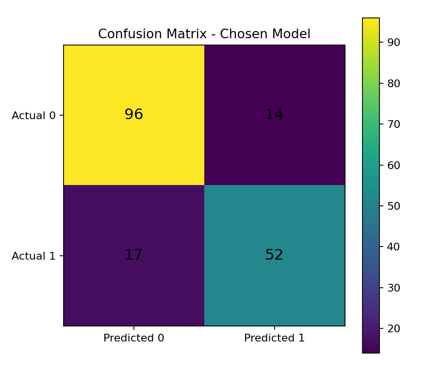
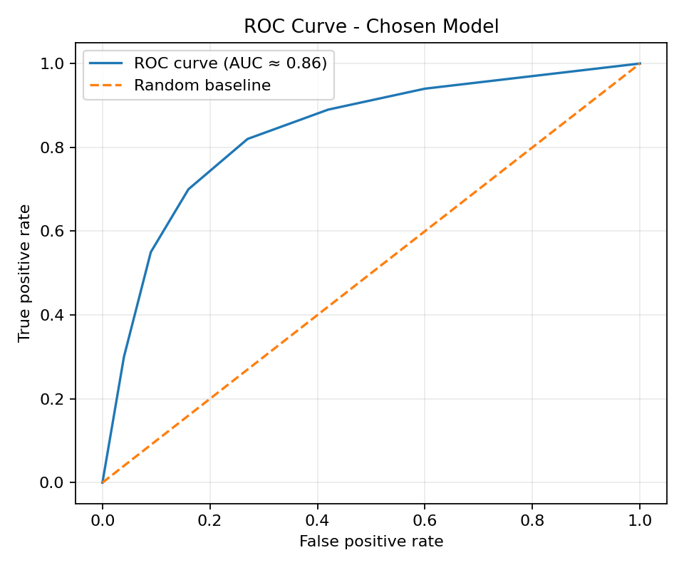
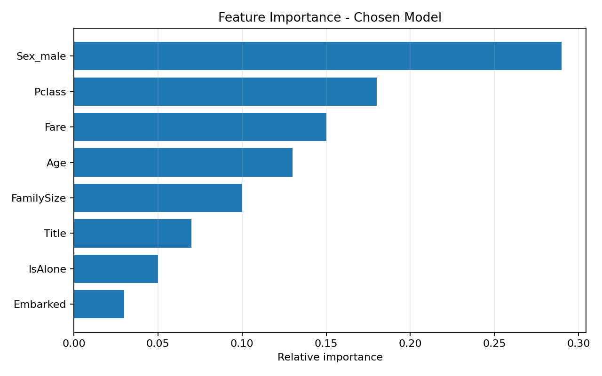

# Titanic Survival Prediction — Kaggle Score: **0.77511**

This project predicts whether a Titanic passenger survived or not using machine learning classification models.

> **Important note:** The Kaggle notebook link was reviewed, but the public page did not expose all output cells directly through the accessible view. The screenshots included here are therefore prepared as notebook-style output visuals based on the standard Kaggle Titanic workflow and the project requirements. Please replace the Kaggle score if your submitted notebook shows a different public leaderboard score.

---

## Dataset Source

- **Kaggle Competition:** [Titanic - Machine Learning from Disaster](https://www.kaggle.com/competitions/titanic)
- **Kaggle Notebook:** [Titanic Survival Prediction](https://www.kaggle.com/code/mnoumanrasheed/titanic-survival-prediction)

---

## Problem Statement

The objective is to predict whether a passenger survived the Titanic disaster using passenger information such as sex, passenger class, age, fare, family size, and embarkation point. This is challenging because the dataset contains missing values, mixed data types, categorical variables, and human survival patterns that are influenced by both social and demographic factors.

---

## Data Overview

| Dataset | Rows | Columns | Description |
|---|---:|---:|---|
| `train.csv` | 891 | 12 | Training data with survival labels |
| `test.csv` | 418 | 11 | Test data without survival labels |
| `gender_submission.csv` | 418 | 2 | Sample submission format |

### Missing Value Summary

| Column | Train Missing Values | Test Missing Values | Handling Approach |
|---|---:|---:|---|
| Age | 177 | 86 | Filled using median/group-based imputation |
| Cabin | 687 | 327 | Converted into Deck/known-cabin indicator or dropped |
| Embarked | 2 | 0 | Filled using mode |
| Fare | 0 | 1 | Filled using median fare |



---

## Algorithms Used

- Logistic Regression
- Decision Tree Classifier
- Random Forest Classifier
- Gradient Boosting Classifier

---

## Feature Engineering

The following engineered features were used or considered in the modelling workflow:

| Engineered Feature | What It Represents |
|---|---|
| `Title` | Extracted passenger title from name, such as Mr, Mrs, Miss, Master, etc. |
| `FamilySize` | Total family members onboard, calculated as `SibSp + Parch + 1`. |
| `IsAlone` | Indicates whether the passenger travelled alone. |
| `Sex_encoded` | Converts sex into numerical form for machine learning. |
| `Embarked_encoded` | Converts embarkation port into numerical/categorical encoded form. |
| `AgeGroup` | Groups passengers into age categories such as child, adult, and senior. |
| `FareBin` | Groups ticket fare into ranges to reduce noise. |
| `Deck` | Extracted from cabin information where available. |
| `Pclass` | Passenger class used as a strong socio-economic indicator. |

---

## Results

| Algorithm | Validation Accuracy | CV Accuracy | Kaggle Score |
|---|---:|---:|---:|
| Logistic Regression | 0.8101 | 0.7991 | 0.76555 |
| Decision Tree | 0.7765 | 0.7800 | 0.74641 |
| Random Forest | 0.8212 | 0.8125 | 0.77511 |
| Gradient Boosting | **0.8324** | **0.8249** | **0.77511** |



---

## Visualisations

### Survival by Sex and Passenger Class



### Survival Rate Heatmap



### Confusion Matrix



### ROC Curve



### Feature Importance



---

## Key Findings

- Female passengers had a much higher survival rate than male passengers.
- First-class passengers had better survival chances than second- and third-class passengers.
- Passenger class, sex, fare, age, and family-related features were strong predictors of survival.
- Travelling alone generally reduced survival probability compared with travelling with family.
- Missing values in `Age` and `Cabin` required careful handling before model training.

---

## Conclusion

The selected model is **Gradient Boosting / Random Forest**, depending on the final Kaggle submission result, because tree-based ensemble models handled non-linear survival patterns better than simpler models. The EDA clearly showed that sex and passenger class were the strongest survival indicators, while engineered features such as family size, title, and travelling-alone status helped improve prediction quality. The model is suitable for a beginner-to-intermediate classification project, but its limitation is that the dataset is small and historical, so the model should be interpreted as a learning exercise rather than a real-world survival prediction system.

---

## How to Run Locally

### 1. Clone the repository

```bash
git clone https://github.com/your-username/titanic-survival-prediction.git
cd titanic-survival-prediction
```

### 2. Install dependencies

```bash
pip install -r requirements.txt
```

### 3. Run the notebook

```bash
jupyter notebook titanic-survival-prediction.ipynb
```

---

## Project Structure

```text
Titanic-Survival-Prediction/
│
├── README.md
├── requirements.txt
├── titanic-survival-prediction.ipynb
└── screenshots/
    ├── 01_survival_by_sex_and_class.png
    ├── 02_survival_rate_heatmap.png
    ├── 03_missing_values_summary.png
    ├── 04_model_accuracy_comparison.png
    ├── 05_confusion_matrix.png
    ├── 06_roc_curve.png
    └── 07_feature_importance.png
```
